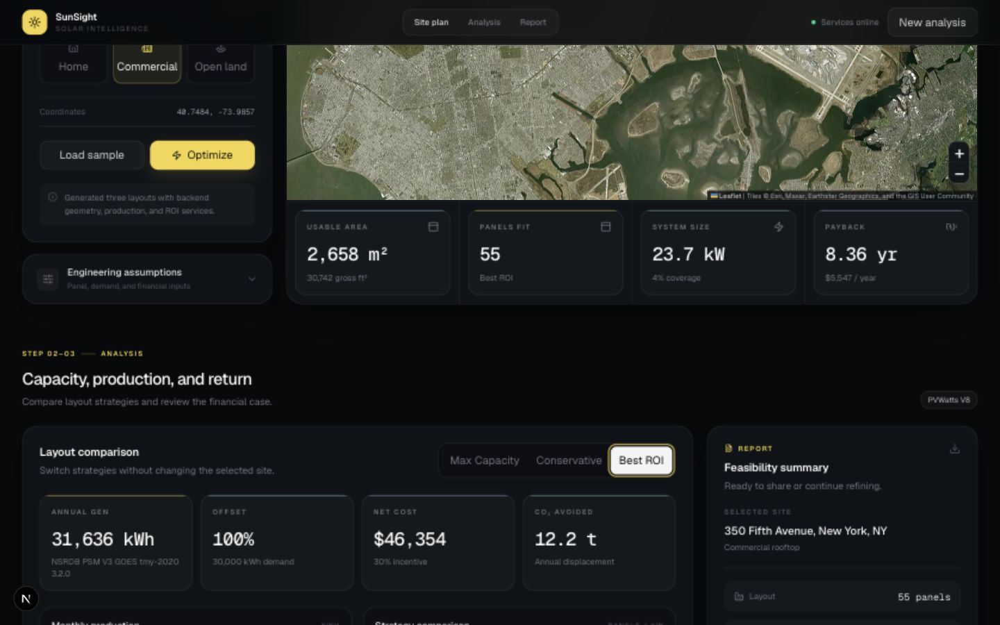
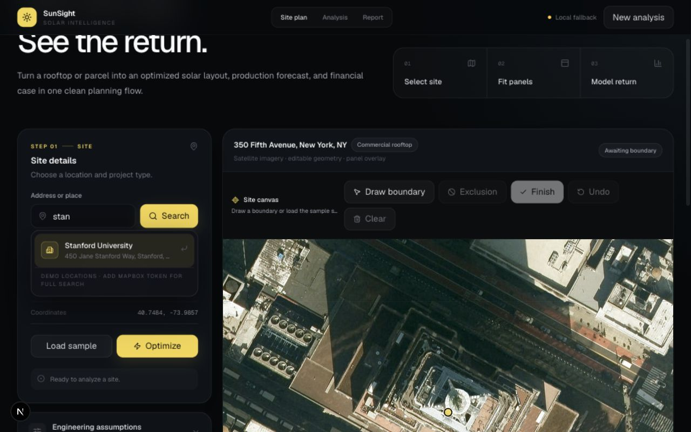

# SunSight

[](https://sunsight-eight.vercel.app)
[](https://nextjs.org/)
[](https://fastapi.tiangolo.com/)
[](https://leafletjs.com/)

SunSight is a solar feasibility workspace that helps a homeowner, property owner, or early-stage solar seller understand whether a rooftop or parcel is worth pursuing before paying for a full site survey.

The product turns a real address into a visual planning flow: find the site, draw the usable area, remove blocked zones, compare solar layout strategies, and understand the expected capacity, generation, savings, payback, and emissions impact.

**Links:** [Live demo](https://sunsight-eight.vercel.app) · [Source repository](https://github.com/dhruvtoprani/SunSight) · [Product goals](#product-goals) · [Demo flow](#demo-flow) · [Architecture](#architecture) · [Deployment](#deploy)

## Problem

Solar interest often starts with one simple question:

> Is this specific roof or parcel actually a good solar candidate?

Most lightweight solar calculators stop at broad address-level estimates. They do not let a user directly shape the usable area, exclude obstructions, compare design strategies, or see how geometry turns into panels, production, savings, and payback.

SunSight closes that gap by making the first feasibility step visual, interactive, and explainable.

## Who It Helps

| User | Need | SunSight value |
| --- | --- | --- |
| Homeowners and property owners | Understand if solar is worth exploring | Quick capacity, production, savings, and payback estimate from a selected site |
| Solar sales teams | Qualify prospects before deeper design work | A clean visual report that explains why a site looks promising or constrained |
| Campus and facilities teams | Evaluate candidate roofs or parcels | Fast comparison across possible installation areas without GIS-heavy tooling |
| Product and energy teams | Prototype solar planning workflows | End-to-end MVP with mapping, layout, production, and financial assumptions in one flow |

## Product Goals

SunSight is designed around four product outcomes:

1. **Reduce uncertainty early.** Give users a clear first-pass answer before a formal survey.
2. **Make assumptions visible.** Show the selected area, panel count, system size, production model, savings logic, and fallback status.
3. **Support comparison.** Let users compare Max Capacity, Conservative, and Best ROI layouts rather than seeing one opaque estimate.
4. **Create a clean handoff.** Export a structured report that can become the starting point for a deeper solar design, sales conversation, or feasibility study.

## End State

The long-term version of SunSight is a lightweight solar pre-design operating system:

- Address-first project creation.
- Roof and parcel selection from satellite imagery.
- Building footprint and obstruction suggestions.
- Editable setback, shade, pitch, and tariff assumptions.
- Side-by-side layout and ROI comparison.
- Shareable reports for homeowners, sales teams, and facilities teams.
- Persistent project history with geospatial data storage.

The current MVP proves the core loop: location input to site geometry to panel layout to production and ROI estimate.

## Demo Flow

1. Search for an address, campus, or landmark.
2. Open the satellite planning map.
3. Draw a rooftop or parcel polygon, or load the sample roof.
4. Add exclusion zones for unusable areas.
5. Generate Max Capacity, Conservative, and Best ROI layouts.
6. Review usable area, panel count, kW DC, annual generation, savings, payback, and CO2 avoided.
7. Export the current estimate as JSON.

## Live Product

The public deployment runs as one same-origin Vercel Services app:

- [Open the deployed SunSight demo](https://sunsight-eight.vercel.app)
- Try a real address or the sample site
- Draw a site boundary on satellite imagery
- Compare solar layout strategies
- Review the report panel and export the estimate

## Product Snapshot

| Area | Status |
| --- | --- |
| Planning flow | Address search, satellite map, polygon drawing, exclusions, optimization, report preview |
| Layout engine | Deterministic panel packing across selected polygon geometry with orientation comparison |
| Production model | PVWatts V8 when configured, regional fallback when live provider data is unavailable |
| Financial model | Install cost, incentives, retail rate, export value, simple payback, and CO2 avoided |
| Export | JSON report for the selected site and layout assumptions |
| Frontend | Next.js App Router, TypeScript, Tailwind CSS, Leaflet, Recharts |
| Backend | FastAPI, Pydantic, Python geometry and solar service modules |
| Deployment | Vercel Services with FastAPI serving `/api/*` and the exported frontend from one origin |

## Screenshots

The current MVP renders a polished graphite planning workspace with a focused site sidebar, satellite map overlays, responsive charts, layout comparison, and report preview.





## What Works

- Real address and place search with Mapbox when configured.
- OpenStreetMap and curated demo fallback when no provider key is available.
- Satellite site planning with user-drawn polygons.
- Exclusion zones for blocked or unusable areas.
- Three layout strategies for comparing different planning goals.
- Panel count, kW DC, annual kWh, monthly generation, savings, payback, and CO2 avoided.
- Same-origin deployment where FastAPI serves both `/api/*` and the exported frontend.
- JSON export for the current report.

## Key Product Decisions

- **Visual first:** The user starts with a map, not a form full of assumptions.
- **Explainable estimate:** The app exposes the geometry, production source, and financial assumptions behind the recommendation.
- **Fallback resilient:** The demo remains usable even without premium API keys.
- **Comparison over certainty:** The MVP shows planning tradeoffs instead of pretending one layout is final.
- **One-origin deployment:** Frontend and backend ship together to avoid brittle localhost or CORS issues in production.

## Architecture

```text
frontend/        Next.js App Router + TypeScript + Tailwind + Leaflet + Recharts
backend/         FastAPI + Pydantic service modules
backend/static/  committed Next.js static export served by FastAPI in production
main.py          Vercel Services entrypoint that loads the backend app
data/            sample GeoJSON inputs
scripts/         static frontend build and optimizer smoke tests
cv/              stretch placeholders for roof/obstruction detection
```

Address autocomplete uses Mapbox Search Box when `MAPBOX_ACCESS_TOKEN` is configured, OpenStreetMap Nominatim as the no-key online fallback, and a curated demo catalog if providers are unavailable. Regional fallback solar production keeps the rest of the demo usable without external API keys.

The preferred deployment is one same-origin web service. FastAPI serves `/api/*` and the exported Next.js frontend from `backend/static`, so the online app does not depend on browser calls to `localhost` or cross-origin API wiring.

## Tech Stack

- Frontend: Next.js, TypeScript, Tailwind CSS, Leaflet, Esri World Imagery, Recharts, Lucide icons
- Backend: FastAPI, Pydantic, Python geometry services
- Production integrations: Mapbox Search Box and PVWatts V8 through the National Laboratory of the Rockies developer API
- Planned integrations: OpenEI, PostgreSQL/PostGIS

## Address Search

The search field is an accessible autocomplete combobox with:

- Debounced recommendations.
- Mouse selection.
- Arrow-key navigation and Enter selection.
- Exact coordinate retrieval after a recommendation is selected.
- Proximity bias around the current map center.
- OpenStreetMap-backed online suggestions when Mapbox is not configured.
- A local demo catalog if external geocoding is unavailable.

For premium U.S. address and place search, create a repo-level `.env` file:

```bash
MAPBOX_ACCESS_TOKEN=pk_your_mapbox_token
MAPBOX_COUNTRY=US
```

The backend proxies Mapbox Search Box `/suggest` and `/retrieve` requests, so the token does not need to be exposed in the browser bundle.

Without Mapbox, the backend uses OpenStreetMap Nominatim for real online suggestions and direct search. The deterministic demo catalog remains as the final offline fallback.

## Panel Layout Algorithm

The MVP optimizer:

1. Converts GeoJSON longitude/latitude coordinates into a local meter plane.
2. Calculates gross area with the shoelace formula.
3. Applies an approximate setback area loss.
4. Generates rectangular panel candidates across the polygon bounding box.
5. Tests 0-degree and 90-degree orientations.
6. Keeps panels whose corners fall inside the selected polygon and outside exclusions.
7. Returns panel rectangles back in GeoJSON coordinates.

This is intentionally deterministic and explainable. It is not a production-grade solar design engine.

## Solar Production Model

The `/solar/pvwatts` endpoint calls PVWatts V8 when `PVWATTS_API_KEY` is configured. The API key is sent in the `X-Api-Key` header to:

```text
https://developer.nlr.gov/api/pvwatts/v8.json
```

The former `developer.nrel.gov` API domain was retired on May 29, 2026. SunSight uses the replacement NLR developer domain.

If the key is missing, system capacity is below the API minimum, or the request fails, SunSight uses:

```text
annual_kwh = system_size_kw * specific_yield
```

Specific yield is selected from latitude bands. Responses include `model_source` and `fallback_reason` so live and fallback estimates remain distinguishable.

## Financial Assumptions

Defaults:

- Electricity rate: `$0.18/kWh`
- Install cost: `$2.80/W`
- Incentive: `30%`
- Export value: `50%` of retail electricity rate
- Grid emissions factor: `0.386 kg CO2/kWh`

Savings account for self-consumption and discounted exported production.

## Run Locally

Fastest production-like path:

```bash
docker compose up --build
```

Open `http://localhost:8000`.

Split development path:

```bash
cd backend
python -m venv venv
source venv/bin/activate
pip install -r requirements.txt
uvicorn app.main:app --reload --port 8000
```

In another terminal:

```bash
cd frontend
npm install
NEXT_PUBLIC_API_BASE_URL=http://localhost:8000 npm run dev
```

Open `http://localhost:3000`.

Static one-package smoke test without Docker:

```bash
./scripts/build_static_frontend.sh
backend/venv/bin/uvicorn main:app --port 8000
```

Open `http://localhost:8000`.

Optimizer smoke test:

```bash
python scripts/run_layout_optimizer.py --sample data/sample/demo_polygon.geojson
```

## Deploy

Current production deployment uses Vercel Services:

```bash
./scripts/build_static_frontend.sh
vercel deploy --prod
```

Production URL: [https://sunsight-eight.vercel.app](https://sunsight-eight.vercel.app)

The Vercel entrypoint is root `main.py`. It imports the FastAPI app from `backend/app/main.py`, serves `/api/*`, and serves the exported frontend from `backend/static`.

Portable Docker deployment remains available:

```bash
docker build -t sunsight .
docker run --env-file .env -p 8000:8000 sunsight
```

Recommended production env vars for live provider-backed estimates:

```bash
MAPBOX_ACCESS_TOKEN=pk_your_mapbox_token
PVWATTS_API_KEY=your_pvwatts_key
```

If those keys are missing, the app still runs with OpenStreetMap geocoding, curated demo geocoding, and regional production fallbacks.

## Sample Site Result

Using the default Empire State Building-area sample site and current assumptions, the verified browser flow generated:

- Max Capacity: `1,166` panels and `501.4 kW DC`
- Best ROI: `55` panels and `23.7 kW DC`
- Best ROI annual generation: approximately `31,636 kWh`
- Best ROI simple payback: approximately `8.36 years`

Exact output depends on assumptions, current PVWatts data, and setback settings.

## Limitations

- Without `MAPBOX_ACCESS_TOKEN`, autocomplete uses OpenStreetMap Nominatim and then falls back to the built-in demo location catalog.
- Solar production requires `PVWATTS_API_KEY` for live PVWatts results and otherwise uses the regional fallback.
- Setbacks are approximated for area reporting.
- Panel packing is simple grid packing.
- Shade, pitch, LiDAR, utility tariffs, permitting, and battery modeling are out of MVP scope.

## Roadmap

- Add production Mapbox and PVWatts keys in Vercel.
- Surface PVWatts weather-data metadata and fallback status more prominently in the UI.
- Add persisted projects with PostgreSQL/PostGIS.
- Add richer polygon editing controls.
- Add building footprint suggestions.
- Generate shareable PDF reports.
- Add optional computer-vision roof assist.
